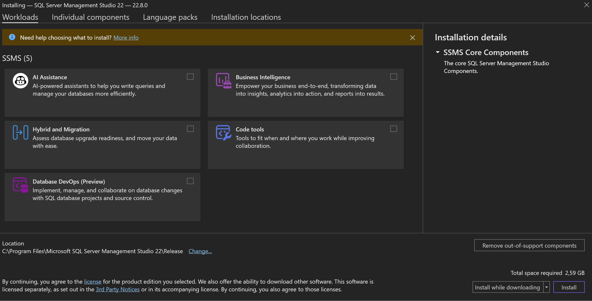
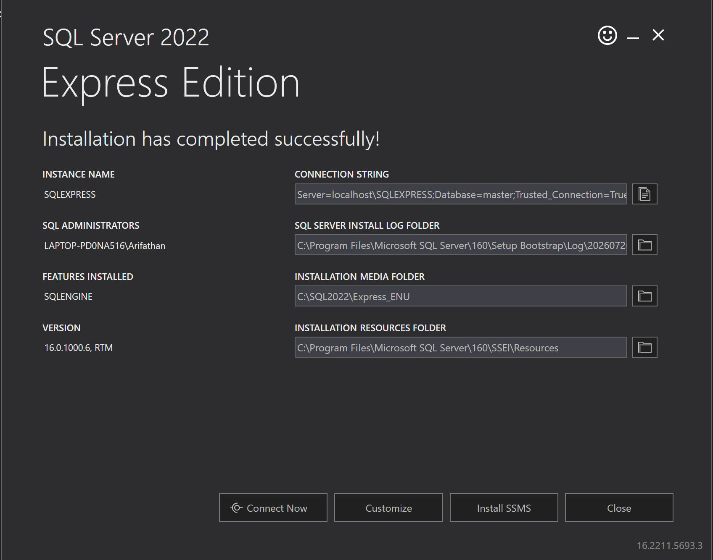
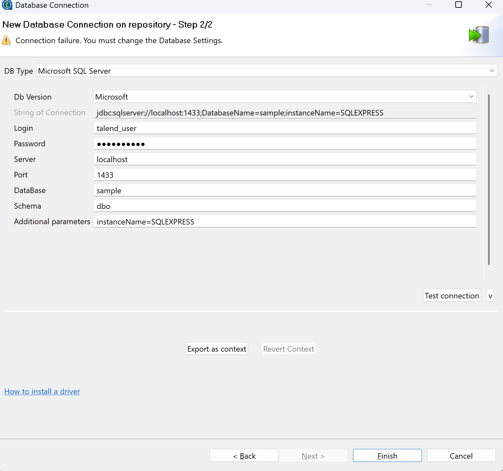
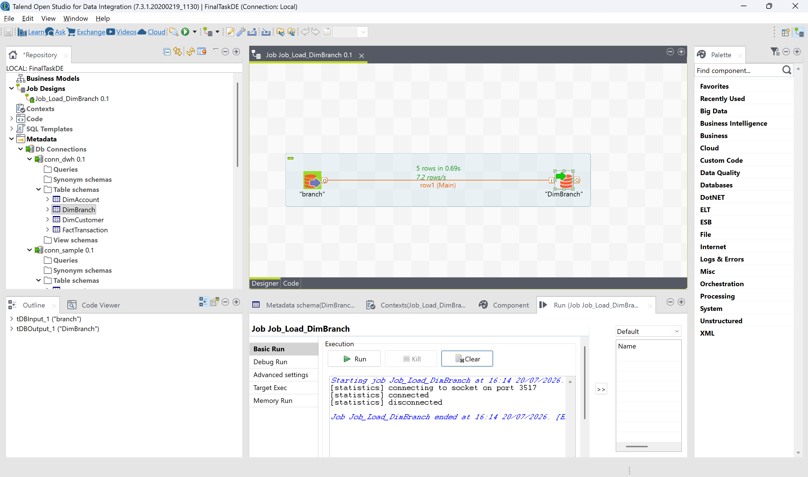
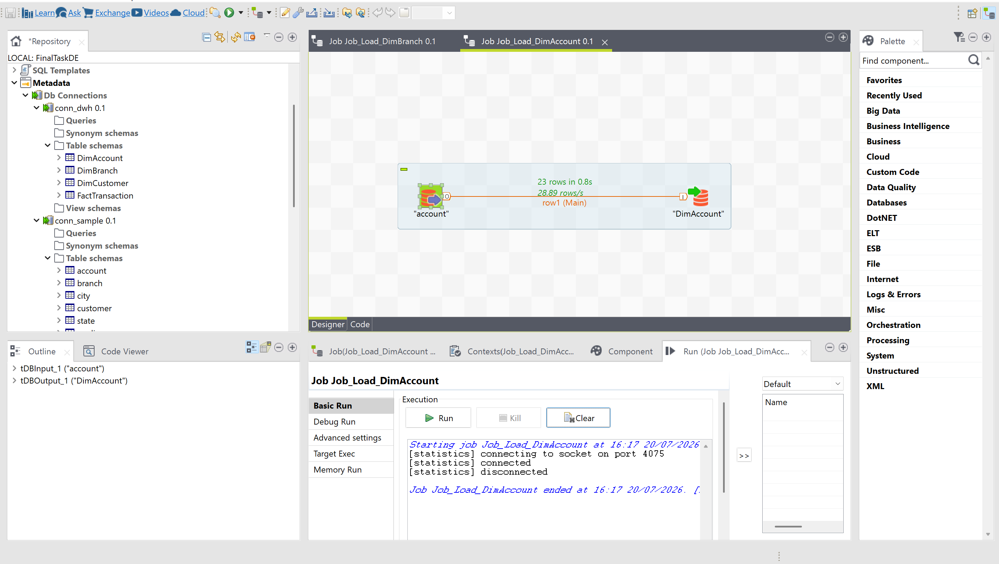
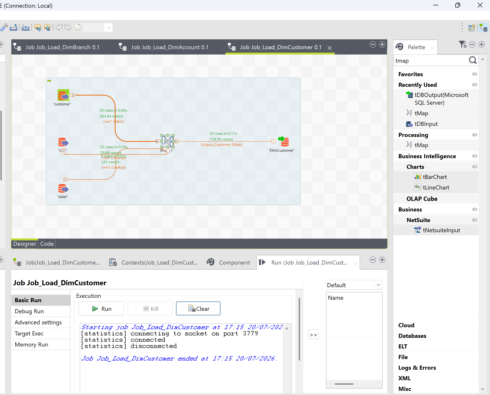
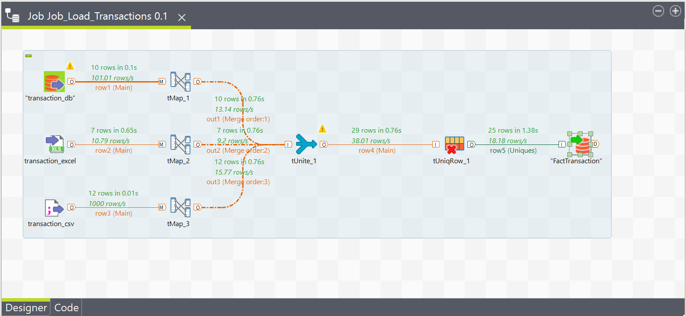
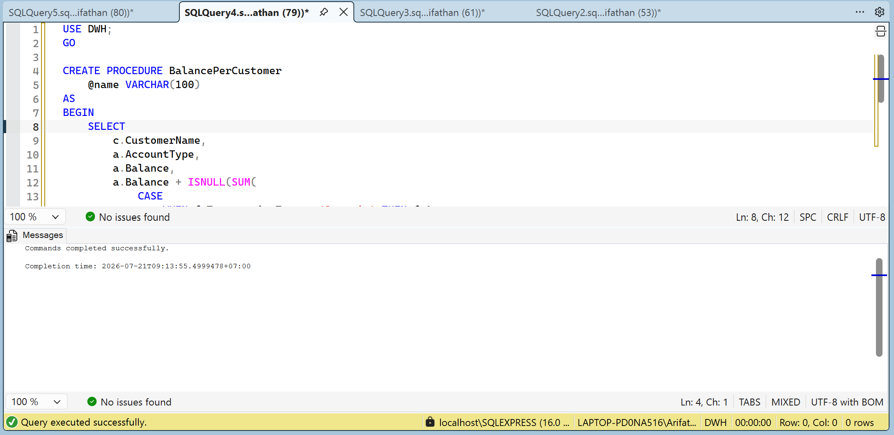
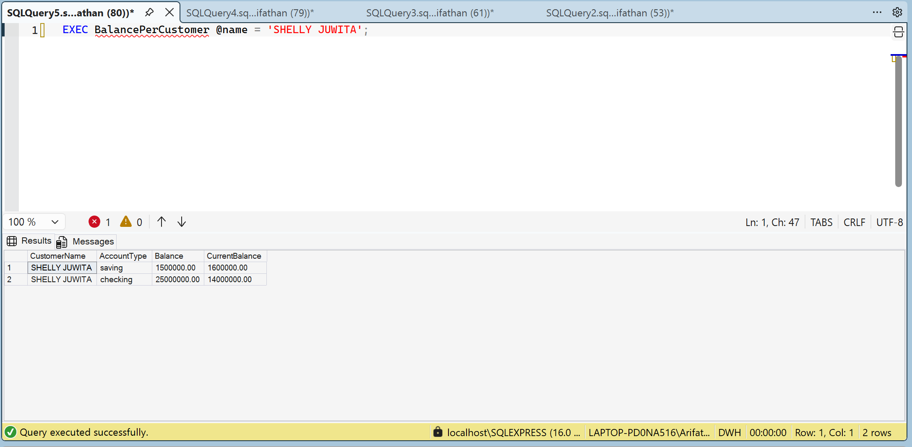

# Final Project - Data Engineer Internship at IDX Partners

Welcome to the repository for my Final Project as part of the Data Engineer Virtual Internship at **IDX Partners** (id/x). This repository contains the resources, scripts, and documentation resulting from the internship program.

## 📌 Project Overview

This final project demonstrates the core competencies of a Data Engineer, focusing on the end-to-end process of building a Data Warehouse (DWH) for a financial institution. The project covers data extraction, transformation, loading (ETL), and the creation of analytical data models to support business intelligence and reporting.

## 🗂️ Repository Structure

- **`/Final Project`**: Contains the final presentation (`FinalTask_IDX Partners_DE_Nama Lengkap.pptx`) and related final task files.
- **`/Week1`, `/Week2`, `/Week3`**: Directories containing weekly tasks and assignments completed during the internship program.
- **`/asset`**: Folder containing screenshots of the project flow.
- **`StoredProcedure_BalancePerCustomer.sql`**: SQL script for `BalancePerCustomer` stored procedure.
- **`StoredProcedure_DailyTransaction.sql`**: SQL script for `DailyTransaction` stored procedure.
- **`/TOS_DI-20200219_1130-V7.3.1`**: Talend Open Studio used for building the ETL pipelines.

---

## 🚀 Alur Pengerjaan (Workflow)

Berikut adalah dokumentasi langkah demi langkah dari pengerjaan Final Project ini, mulai dari persiapan _environment_ hingga pembuatan Stored Procedure.

### 1. Persiapan & Download Dependencies
Langkah pertama dalam project ini adalah menyiapkan _environment_ untuk database dan tools ETL yang akan digunakan. Proses ini meliputi pengunduhan dan instalasi Microsoft SQL Server, SQL Server Management Studio (SSMS), dan Talend Open Studio (TOS).

### 2. Proses ETL (Extract, Transform, Load) menggunakan Talend
Setelah semua tools siap, langkah selanjutnya adalah mendesain Data Warehouse (Star Schema) dan membangun pipeline ETL di Talend. Data dari sumber _source_ ditarik, ditransformasi, lalu di-load ke dalam tabel dimensi dan tabel fakta di DWH.

### 3. Pembuatan Stored Procedure di SSMS
Data yang telah tersimpan rapi di Data Warehouse (DWH) kemudian dimanfaatkan untuk kebutuhan analitik. Pada tahap ini, dibuatlah Stored Procedure menggunakan T-SQL di dalam SSMS untuk mempermudah pemanggilan laporan atau agregasi data yang kompleks.

**Stored Procedure 1: `DailyTransaction`**
Stored Procedure ini menerima rentang tanggal (`@start_date` dan `@end_date`) untuk menghitung total transaksi dan total nominal per hari.

**Stored Procedure 2: `BalancePerCustomer`**
Stored Procedure ini berguna untuk menghitung saldo terkini (Current Balance) milik kustomer berdasarkan nama kustomer dengan mengakumulasikan transaksi Deposit dan Withdrawal.

---

## 🛠️ Technology Stack

- **Database**: Microsoft SQL Server (T-SQL)
- **Database Management**: SQL Server Management Studio (SSMS)
- **ETL Tool**: Talend Open Studio untuk Data Integration

*This project was completed as part of the Virtual Internship Experience by Rakamin Academy and IDX Partners.*
